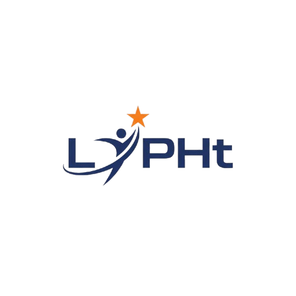

<div align="center">
  

  <h1>LiPHt</h1>

  <p>A web platform connecting Filipino communities to scholarships, livelihood programs,<br/>and opportunities that uplift lives and fight poverty.</p>

  <p>
    
    
    
    
    
    
    
  </p>
</div>

---

## Overview

**LiPHt** (*Uplifting Filipinos, Unlocking Futures*) is a community-driven web platform designed to bridge the gap between Filipino families and life-changing resources. Users can discover scholarships, government programs, training initiatives, and livelihood opportunities — all in one place — with a guided application experience and AI-powered support.

Aligned with **SDG 1 (No Poverty)**, LiPHt aims to create meaningful impact across all 81 provinces of the Philippines.

---

## Features

- **Opportunity Discovery** — Centralized listings of scholarships, training programs, and livelihood initiatives from government agencies and private organizations
- **SDG 1 Advocacy** — Dedicated section covering No Poverty goals, beneficiary stories, advocacy articles, and progress tracking
- **Donate & Get Involved** — Integrated donation flow with QR code support and showcase of past donations
- **AI Chatbot Support** — In-app chatbot powered by a Supabase Edge Function to guide users through the platform
- **Secure Authentication** — Supabase-managed sign-up, login, and session handling with JWT tokens
- **User Profiles** — Personalized profiles to track interests and application activity
- **Admin Dashboard** — Internal dashboard for managing opportunities and platform content
- **Scroll Animations** — Smooth, scroll-triggered reveal animations throughout the UI
- **Responsive Design** — Mobile-first layout accessible on all screen sizes

---

## Tech Stack

| Layer | Technology |
|---|---|
| UI Framework | [React 18](https://react.dev/) with TypeScript |
| Build Tool | [Vite 5](https://vitejs.dev/) |
| Styling | [Tailwind CSS 3](https://tailwindcss.com/) with [Shadcn UI](https://ui.shadcn.com/) (Radix UI) |
| Backend & Auth | [Supabase](https://supabase.com/) (PostgreSQL, Auth, Edge Functions) |
| Additional Services | [Firebase 12](https://firebase.google.com/) |
| Routing | [React Router DOM v6](https://reactrouter.com/) |
| Data Fetching | [TanStack Query v5](https://tanstack.com/query) |
| Forms | [React Hook Form](https://react-hook-form.com/) + [Zod](https://zod.dev/) |
| Runtime | Node.js ≥ 18 |

---

## Getting Started

### Prerequisites

Ensure you have the following installed before proceeding:

- **Node.js** `≥18.0.0`
- **npm** (bundled with Node.js)
- A **Supabase** project (for backend services)

---

### Installation

**1. Clone the repository**

```bash
git clone https://github.com/gwenndestura/LiPHt.git
```

**2. Navigate into the project directory**

```bash
cd LiPHt
```

**3. Install dependencies**

```bash
npm install
```

**4. Set up environment variables**

Create a `.env` file in the project root and add your Supabase credentials:

```env
VITE_SUPABASE_URL=your_supabase_project_url
VITE_SUPABASE_PUBLISHABLE_KEY=your_supabase_publishable_key
```

**5. Start the development server**

```bash
npm run dev
```

Open your browser and go to `http://localhost:5173`.

---

### Production Build

**Build for production**

```bash
npm run build
```

**Preview the production build locally**

```bash
npm run preview
```

---

## Project Structure

```
LiPHt/
├── public/
│   ├── favicon.ico
│   └── robots.txt
├── src/
│   ├── assets/                   # Logos, images, and static resources
│   ├── components/
│   │   ├── ui/                   # Shadcn UI base components
│   │   ├── Chatbot.tsx           # AI-powered in-app chat support
│   │   ├── DonateModal.tsx       # Donation flow with QR code support
│   │   ├── DonationShowcase.tsx  # Gallery of past donations
│   │   ├── Footer.tsx            # Site footer
│   │   ├── Navigation.tsx        # Top navigation bar
│   │   ├── NavLink.tsx           # Navigation link component
│   │   └── OpportunityCard.tsx   # Opportunity listing card
│   ├── hooks/
│   │   ├── useAuth.tsx           # Authentication state hook
│   │   └── useScrollAnimation.tsx # Scroll-triggered animation hook
│   ├── integrations/
│   │   └── supabase/             # Supabase client and type definitions
│   ├── pages/
│   │   ├── about/
│   │   │   ├── Advocacy.tsx      # SDG 1 advocacy content
│   │   │   ├── Articles.tsx      # Blog and news articles
│   │   │   ├── Beneficiaries.tsx # Beneficiary stories
│   │   │   └── SDG1.tsx          # SDG 1 overview page
│   │   ├── admin/
│   │   │   └── Dashboard.tsx     # Admin management dashboard
│   │   ├── Auth.tsx              # Login and sign-up
│   │   ├── Contact.tsx           # Contact form
│   │   ├── Donate.tsx            # Donation page
│   │   ├── GetInvolved.tsx       # Volunteer and partnership page
│   │   ├── Home.tsx              # Landing page
│   │   ├── Opportunities.tsx     # Opportunity listings
│   │   ├── Profile.tsx           # User profile
│   │   └── SDG.tsx               # SDG overview
│   ├── App.tsx                   # Root component and routing
│   └── main.tsx                  # Application entry point
├── supabase/
│   ├── functions/
│   │   ├── chat/                 # Chatbot edge function
│   │   └── send-notification/    # Notification edge function
│   └── migrations/               # Database migration scripts
├── index.html
├── vite.config.ts
└── package.json
```

---

## Development Team

| Name | Role |
|---|---|
| Princess Gwenn A. Destura | Developer |
| Mao Zeth A. Abel | Developer |
| Kyle Cedric R. Panganiban | Developer |

---

<div align="center">
  <sub>Uplifting Filipinos, Unlocking Futures &nbsp;·&nbsp; Aligned with UN SDG 1 — No Poverty</sub>
</div>
